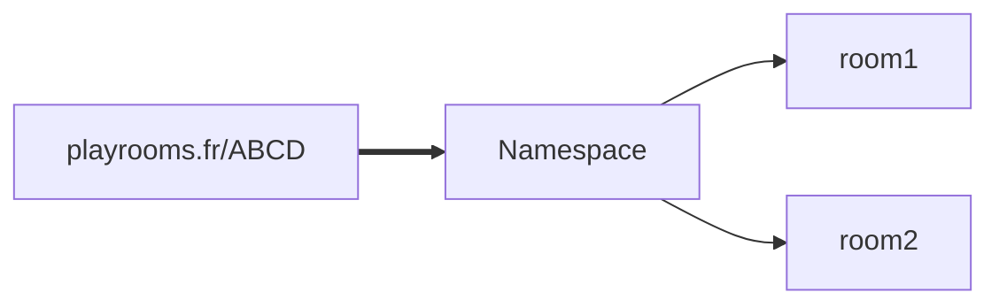

# Questions pour des pigeons

Ce jeu est un jeu d'équipe en ligne disponible à la fois sur PC et mobile grâce à son design ``responsive``, il faudra savoir être créatif afin de battre l'équipe adverse et avoir une équipe soudée !


Ce jeu est disponible à l'adresse suivante : ~~[Playrooms.fr](http://playrooms.fr)~~

La nouvelle adresse temporaire du site web est : http://51.75.125.2:8080/

## 1. Introduction

Ce jeu a entièrement été développé en utilisant aucun Framework. C'est également mon premier projet tournant sous ``Node.js``.

Ce projet a pour but d'expérimenter le développement d'applications Full Stack.

### Technologies utilisées dans le projet :

* ``Socket.io`` qui permet la communication en temps réel entre les joueur en utilisant les Web sockets.
* ``Express.js`` qui permet de déployer un serveur HTTP.
* ``Anime.js`` qui permet de faire des animations avancées en javascript 

Ce projet implémente également une ``API`` et un système de salon automatique allant jusqu'à 10 personnes.

Règles du jeu (simplifiées) :

* 2 équipes (rouge et bleu)
* 16 points chacune
* A chaque tour 2 questions distinctes sont distribuées aux 2 équipes
* Chaque équipe devra composé une réponse 2 questions à inventer (dont au total 1 vraie et 2 fausses)
* Chaque équipe devra pariée l'intégralité de ses points sur une ou plusieurs réponses proposées
* Les points disposés sur les mauvaises réponses sont perdus
* La partie se termine quand une ou aucune des deux équipes n'a plus de points

## 2 . Améliorations possibles

Les gestions des sockets pourrait être améliorer

Utiliser des `Namespaces`  pour les lobbys et les `Room` pour le jeu en lui même :



L'ajout de paramètres de partie.

## 3. Erreurs commises

Durant le développement du projet je n'étais pas encore au courant de différentes notions qui ont été ensuite abordées durant ma formation.

### Les design patterns

Ce projet nécessites d'utiliser le ``State pattern`` qui comme son nom l'indique permet de gérer l'état d'un objet, dans le cadre du projet, mon jeu était un objet qui avait un état qui changeait au fur et à mesure de la partie :

```javascript
room.game_data = {
    state: 'teams',
    teams: [],
    teams_points: [16, 16],
    teams_data: { 0: {}, 1: {} },
    players_data: {},
    next_step_timeout: null,
    next_step_time_start: null,
    next_step_time: null,
    challenges_used: challenges_used == undefined ? [] : challenges_used
}
```

Comme vous pouvez le voir le statut de la partie est géré par une chaine de caractère ce qui s'avère être une très grosse erreur mais également contraire au State Pattern. C'est également le cas pour les salles.

Effectivement cela s'est avéré être très compliqué de maintenir les changements de statut qui sont gérés par un ``switch``

```javascript
switch (data.state) {
    case 'teams':
        data.state = "questions";
        data_to_send.state = "questions";
        ...
    case 'questions':
        data.state = "vote";
        data_to_send.state = "vote";
        ...
    case 'vote':
        data.state = "challenge";
        data_to_send.state = "challenge";
        ...
    case 'challenge':
        room.state = 'lobby';
        data.state = 'lobby';
        ...
```

La gestion des envoies de données n'a pas été faite correctement également


## 4. Ce que j'ai retenu

Ce projet m'a beaucoup apporté, cela me motive encore plus à apprendre et découvrir comment résoudre des problèmes aux quels je devrais faire face dans le futur. J'ai pu grandement m'améliorer grâce à ce dernier et découvrir une vraie passions pour le développement d'applications Full stack.

Malgré les erreurs commisses durant le projet, il y a également beaucoup de positif, par exemple dans la structure du projet mais également le Front end dont je suis fier.

Je suis très fier de ce projet et malgré les défauts dans sa conception cela m'a permit d'apprendre de mes erreurs, le projet fonctionne et j'apprécie pourvoir y jouer avec des amis 😁
