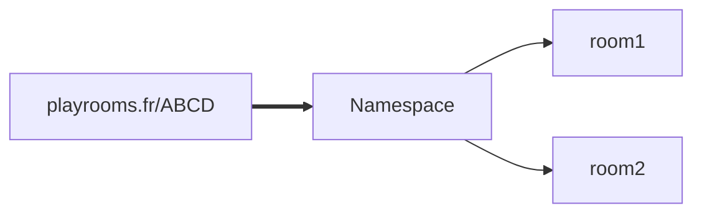

# Question pour des pigeons

---

## 1. Prérequis

Règles (originales) :

* 2 équipes (rouge et bleu)
* 16 jetons chacune
* A chaque tour 2cartes sont distribués aux 2 équipes
* 2 questions à inventer (dont au total 1 vrai et 2 fausses)
* Placement de l'intégralité des jetons
* Ceux sur les mauvaises cases sont perdus

Règles modifiés (non adopté) :

* chaque joueur ont des jetons (points de vie)
* chaque joueur doit déposer l'intégralité de ses jetons 
* si le joueur n'a plus de jetons il est éliminé de l'équipe

Idées supplémentaires : 

* Bonus / Malus tout les 2 manches

## 2 . Amélioration

Utiliser des `Namespaces ` pour les lobbys et les `Room` pour le jeu en lui même :

