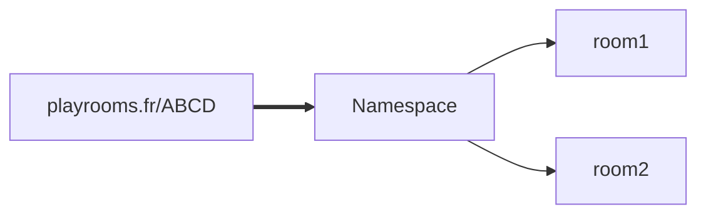

# Question pour des pigeons

Ce jeu est disponible à l'adresse suivante : [Playrooms.fr](http://playrooms.fr)

## 1. Prérequis

Règles:

* 2 équipes (rouge et bleu)
* 16 points chacune
* A chaque tour 2cartes sont distribués aux 2 équipes
* 2 questions à inventer (dont au total 1 vraie et 2 fausses)
* Placement de l'intégralité des jetons
* Ceux sur les mauvaises cases sont perdus

## 2 . Améliorations

Utiliser des `Namespaces`  pour les lobbys et les `Room` pour le jeu en lui même :

